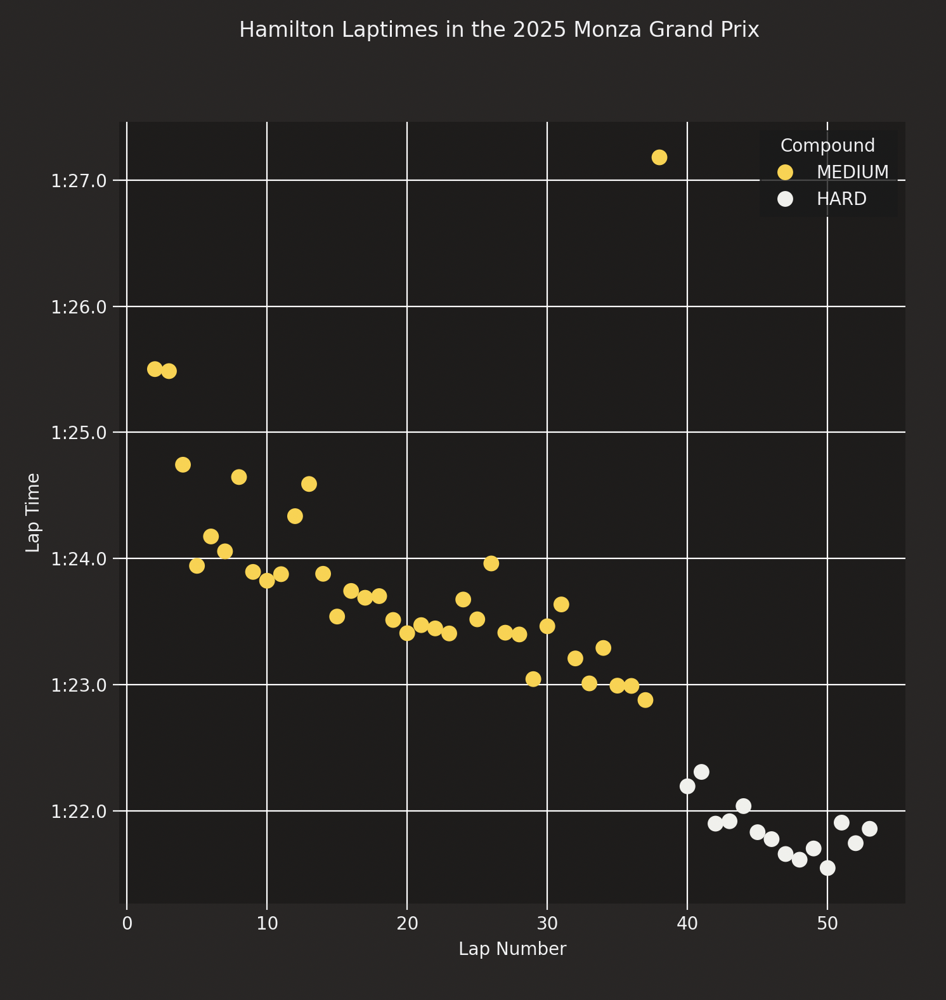
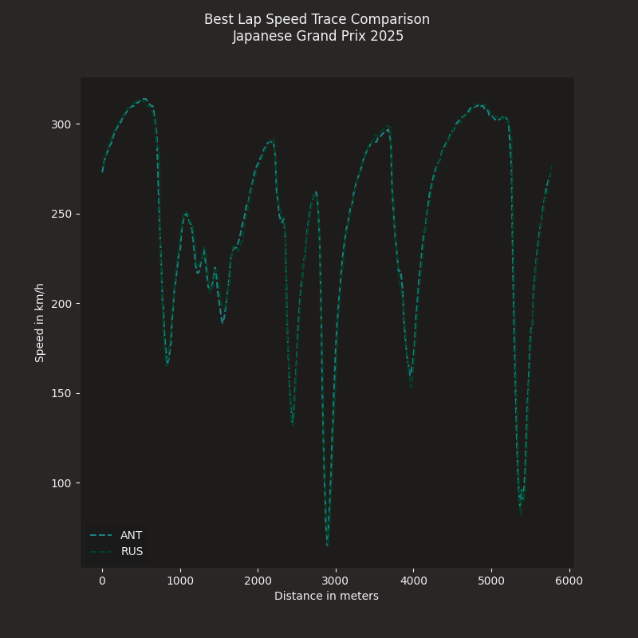
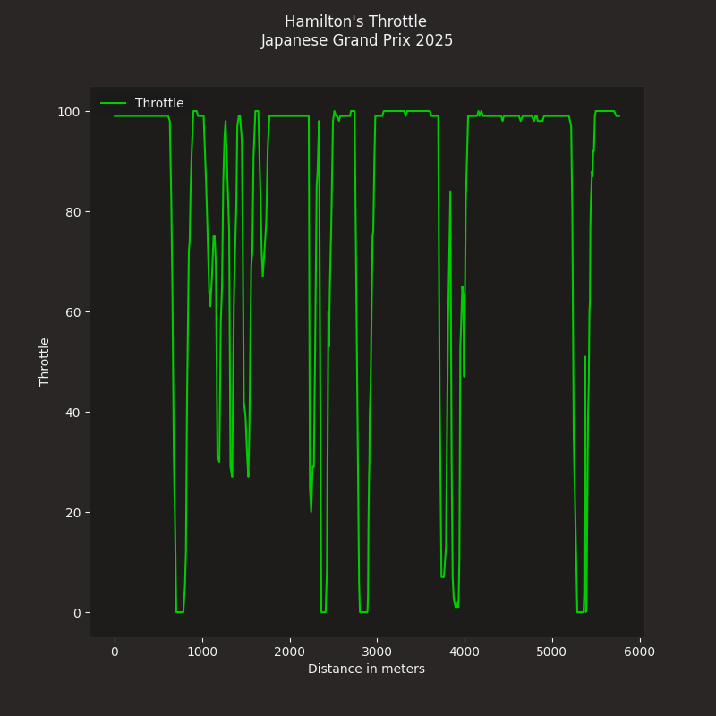

This document acts as a diary to log progress on the project as it is being completed.

Wed 29 July 13:45 
* Initial Project scope is confirmed and repository is created

* The Project scope being:
    * Visualised race track with entities that track each drivers position in sync with drivers
    * Selecting an entity pulls up their respective telemetry; braking, speed, DRS etc.
    * Capacity to select two or more drivers to compare telemetry for analysis
    * 

* Long term goals with the project:
    * Derive meaningful conclusions from the analysis
    * deepen python knowledge

* Today's goals:
    * Familiarise myself with github & set out python foundations

* Achieved:
    * Created Repository and cloned locally onto device
    * Getting Familiar myself with the fastf1 package
    

Sat 1 Aug 12:12
* Continuation of tinkering with fast f1 package
* Since I last approached this project I've been thinking more about what I could possibly apply this application to and I concluded that it would be interesting to investigate two aspects of the sport:
    * Investigate how the changes to the distribution of how the car receives power (ICE vs battery) impacts the nature of the sport and how 
    * Investigate George Russell's claims that Merc is providing the younger, newer driver Kimi Antonelli a better performing car this season to explain what people believe to be a lackluster performance following Hamiltons departure
* These goals I believe give my work a clear direction for what I need to learn in order to find conclusions to these investigatiosn

* Today's goals:
    * Read up on fastf1 documentation regarding telemery 
    * Figure out how to plot telemtry data

* Notes:
    * Telemetry data is included in the session data, make sure that is loaded first 
    * Telemetry data is treated the same as all the other data types
    * Relearned alot of coding fundamentals. Remember to use library shortcuts if using their commands (OBVIOUS)
    * Telemetry data doesnt include braking as a float but as a bool
    * Look into discussion RUS vs ANT
    * Look into how to regulation changes have impacted lap times

* Achieved:
    * Created F1 Speed Trace graph comparision of Antonelli & Russell to compare drivers on the same team
    * Created F1 Throttle Trace graph of Hamilton
    * Familiarising myself with matplotlib again
    
    

Sun 2 Aug 13:00
* First time working in a cafe :) .
* Now that I have an idea of what I'm using my application for, I'm going to look deeper into both of my investigations. Ultimately, depending on how much time I have I may have to compromise and choose one or the other (the power problem).
* If time allows, I'll begin drawing up some graphs for comparison and if possible begin drawing up tracks to investigate the claims even more.
* Considering on making a proper document in LaTeX to relearn that aswell

* After doing more research, I think it will be smarter to increase the scope of how the regulations have changed the aspects of racing. So much has changed in the car this year that I think it is futile to try and compare specifically how the changes to the PU have impacted the driving dynamics of the car when there are so many confounders that could possibly justify reasons in changes to laptimes, sector times, strategy etc.
* After even more research. I've learnt a lot about how drastic these regulations are. Depending on the track, features such as MOM and the narrower track width could impact how drivers behave. I believe to make this test as fair as possible, we should focus on qualifying sessions across a variety of tracks to properly observe how things have changed. tracks like monza with longer straights will benefit with narrower tires as the aerodynamical profile is reduced whereas tracks like Monaco will suffer as the smaller contact patch means each tire will get hotter quickly as the weight is spread across a smaller area. Considering a variety of tracks can help get a bigger perspective on what has changed on a macro scale.

* Today's Goals:
    * Develop deeper understanding of the 2026 regulation changes and learn how that impacts how drivers compete in races
    * Document this information and identify what sections of race strategy have been impacted
    * Begin drawing up some graphs to demonstrate this change 
    * If time permits, begin learning how to visualise this data as entities on a track so we can observe the difference in speed.

* Notes:
    * 2026 Regulation Changes:
        * Nimble Car Concept (NCC):
                * Weight: 724kg + Tyre weight (-30kg) minimum target 
                * Wheelbase: 3400mm (-200mm) 
                * Width: -100mm
                * Floor Width: -150mm
                * Front Wing: -100mm
            * The NCC clearly has the intentions of trying to shrink the size of the newer cars in order reduce the growth of the cars over the years. 
            * Shorter wheelbase allows the car to rotate easier through corners which will allow drivers to apply throttle sooner out of corners. However, the shorter wheelbase can cause the car to be twitchy at high speeds, requiring more input from drivers.
            * Reduced Weight means shorter breaking distances. In a simple example, F = ma, assuming braking force is constant, mass is reduced to the deceleration is greater. This means brakes can be applied later whilst still reaching the maximum speed in corner entry
            * Reduced Width means sharper steering but reduced grip due to greater weight transfer 
            * Adjustments to floor width and front wing reduce wake turbulence, allowing competing cars to follow each other more closely
        * Changes to the Power Unit
                * 2014 - 2025: MGU - H (Motor Generator Unit Heat) & MGU - K (Motor Generator Unit Kinetic). 550kW produced from the ICE element and 120kW from battery power.
                * 2026 Onwards: MGU - H removed & MGU - K. 400kW produced from the ICE element (-150kW) and 350kW from battery power.
            * Lorem Ipsum
        * New Manual Overtake Mode
                *   Drivers within 1s of the lead car can deploy all of the available power in the electrical PU, giving them a significant power delta which can facilitate overtakes.
                * Power delta is also magnified by the tapering of electrical power. All cars past 290km/h begin tapering their electrical power until it runs purely on ICE. This combined with manual overtake means that the power differential in the straights during MOM is greater.
            * Lorem Ipsum
            * Clipping
        * Active Aero Updates
                * Active Aero is now availabkle to everyone at everypoint on the track with capacity to change at predetermined points on track to adjust for straight-line performance or cornering ability
            * Should see decrease in qualifying times
        * Tire Dimensions:
                * Front Tire Width:
                    * -25mm
                    * -30mm
            * Reduces tire contact patch which depending on the track could effect tire life
    * What changes we expect to see in sectors & laptimes
        * Faster corner exit speeds & initial straight line accel
        * Slower top end speeds
        * longer top end

* References:
    * FIA Regulation Press Release [02/07/26] https://www.fia.com/news/f1s-new-era-everything-you-need-know-about-how-fia-making-formula-1-more-competitive-more
    * Grandprixpal 2026 Technical Series [02/07/26] https://www.grandprixpal.com/blog/f1-2026-car-dimensions

* Achieved: 
    * Heavy research into documenting the regulation changes of 2026, learning more about the behaviour of the cars fro the previous generation and how they compare with new regulations and their impact on how drivers maneouver around the track.
    * Establishing what to expect with new rule changes in terms of laptime and sector performance
    * Research ballooned so no initial comparisons could be made

Mon 3 Aug 17:12
* Good afternoon :)
* Short session today to finish what I intended to complete yesterday.
* I've been looking into the F1 Techtalk to help develop the depth of my knowledge and identify specific ways in how teams engage with the new regulations. 
    * Another point regarding fairness, a control variable should be who is the driver

* Today's Goals:
    * Draw up some initial comparison graphs to see the difference and make some initial observations
    * Learn how to visualise the difference in laptimes using the fastf1 library 

* Notes:
    * The API FastF1 uses doesn't appear to have access to the telemetry data for 2026 but has functionality to access locally stored data so will have to find data required elsewhere